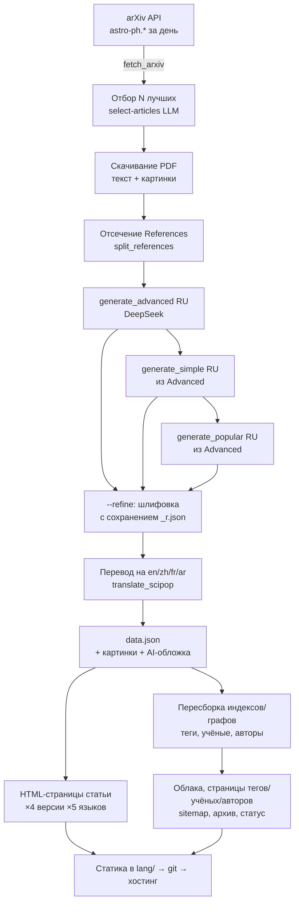
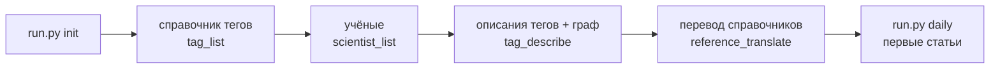

# bridge42worlds — Project Handoff

> Онбординг-документ для нового участника команды. Описывает цель, архитектуру,
> модель данных, порядок инициализации, команды и «фишки» проекта.
> Актуально на 2026-07-20.

---

## 0. Статус передачи (2026-07-20)

Проект передаётся команде разработки — прежний автор подключается периодически на ревью.

- **Живой бэклог задач** — [TODO.md](TODO.md), раздел вверху файла «🚦 ПЕРЕДАЧА КОМАНДЕ
  РАЗРАБОТКИ» → далее «🔴 2026-07-19 (вечер) — БОЛЬШОЙ СПИСОК ОТ ЮЗЕРА» (открытые баги/фичи,
  `[x]`/`[ ]` по каждому пункту). Остальное в TODO.md — журнал прошлых сессий, не список задач.
- **Действующее правило**: мелкие баги — делать сразу; крупные архитектурные фичи (редизайн
  меню/шапки/поиска, unified sticky-header, терминология тег→понятие) — **не начинать без
  явного согласования** с продукт-овнером, они намеренно отложены "на обсудить отдельно".
- **✅ Ранее опасный баг ПОЧИНЕН** (коммит `648065153`): `tag_describe.py`/`law_describe.py`
  раньше могли затереть накопленные графом связи тег/закон↔учёный при любом запуске. Теперь
  оба скрипта ОБЪЕДИНЯЮТ множества (`set(desc) | set(prev)`), а не перезаписывают — связи могут
  только добавляться, обвал (1533→259) физически невозможен. Скрипты запускать безопасно.
  Граф проверен здоров: tags-graph 1538 связей учёных, laws-graph 257 (на 2026-07-20).

---

## 1. Что это и зачем (миссия)

**bridge42worlds** — статический многоязычный научно-популярный сайт, который
**автоматически превращает свежие научные препринты с arXiv в понятные статьи**,
с тремя уровнями сложности изложения + Mini, на нескольких языках (архитектура
не ограничивает число языков; сейчас активны ru/en/es — см. `config.json → languages`).

Идея названия — «мост между двумя мирами»: миром строгой науки (arXiv, формулы,
препринты) и миром обычного любопытного читателя.

**Ключевая ценность:** каждый день выходят сотни статей по астрофизике, которые
никто, кроме специалистов, не читает. Мы берём их полный текст, прогоняем через
LLM и выдаём:
- **три версии + Mini** одной статьи: `popular` (для всех) → `simple` → `advanced` (близко к оригиналу) → `mini` (threads-текст);
- **на нескольких языках** (сейчас ru/en/es; русский — источник, остальные — машинный перевод; архитектура поддерживает и RTL);
- размеченные **тегами** (понятия физики), **законами** (закон/принцип/теорема/эффект — «дом формул»), **учёными** и **авторами**;
- с извлечёнными из PDF картинками, подписями и AI-обложкой (3:2, FLUX-2-pro).

Вокруг статей выстроен **единый граф знаний**: теги⇄законы⇄учёные и их
взаимосвязи, чтобы читатель мог гулять по знанию, а не только по ленте.

---

## 2. Функциональность (что уже есть)

**Контент**
- Пайплайн arXiv → LLM → статичный HTML (полностью автоматический).
- 3 уровня сложности (`popular`/`simple`/`advanced`) + **Mini** (threads-текст, отдельная mini.html);
  переключатель на статье и в ленте: `Популярно | Просто | Подробно | Мини`.
- 5 языков; русский — язык-источник, остальные — машинный перевод справочников и статей.
- Извлечение картинок из PDF + подписи (`figcaption`), мозаика-лента изображений.
- AI-обложки (FLUX-2-pro через DeepInfra, `size: 1440x960` = ровно 3:2) для статей,
  тегов И законов — единый механизм (`run.py images --articles-only|--refs-only`).
  ⚠️ FLUX-2-pro отклоняет width>1440 (400-ошибка) — держи `size` в этих рамках.
- Отсечение списка литературы (References) из текста перед LLM (экономия ~20% токенов).

**Навигация и открытие**
- Главная = бесконечная лента, сгруппированная по дням.
- **Календарь-фильтр** (год→месяц→день) на главной.
- **Фильтр по разделам arXiv** (Cosmology, Exoplanets…) чекбоксами.
- Полнотекстовый поиск + фильтры `#тег @автор !учёный`.
- Страницы тегов, законов, учёных, авторов — каждая со списком релевантных статей,
  мини-графом своего окружения (с BFS-регулятором глубины `+/-`) и AI-обложкой (у тегов/законов).
- Страница автора дополнительно: список его тегов и законов (через пересечение тегов).
- Страница авторов: **алфавитный указатель A–Z** с per-letter страницами + теги-чипсы
  в строках авторов (кликабельные, с тултипами).
- Порядок в меню: `main | tags | laws | scientists | authors | graph | about`.
- **Единый граф знаний** (`/graph/`, `data/knowledge-graph.json`): тег⇄тег⇄закон⇄учёный,
  фильтры по типам узлов/рёбер, пресеты, 3 раздельных поля поиска (тег/закон/учёный) —
  выбор в одном **кросс-фильтрует** даталисты двух других до прямых соседей по графу
  (независимо от BFS-глубины визуализации).
- Облака тегов/законов/учёных со сгруппированными списками (тег — по областям науки
  через поле `domain`, закон — по `type`, учёный — по алфавиту) вместо плашек.
- Архив (краулабельный для SEO) + sitemap на каждый язык.

**UX**
- Тёмная/светлая тема (localStorage).
- Полноценный RTL готов (не используется, пока в `languages` нет RTL-языка).
- Лайки/избранное/отзывы (Supabase: таблицы `likes`/`feedback`/`views`, поля
  `entity_type` (article/tag/law/scientist), `user_key` (UUID в localStorage),
  `device`) + просмотры страниц (`logPageView`).
- «Я автор — подтвердить» (заготовка под верификацию авторов).
- Время чтения, JSON-LD (ScholarlyArticle), счётчик статей/авторов/учёных.

---

## 3. Архитектура

Сайт **полностью статический** — нет бэкенда в рантайме. Есть **генератор**
(Python), который раз в день собирает HTML, и **хостинг статики** (GitHub Pages,
домен `bridge42worlds.org`). Вся «динамика» на клиенте — JS читает готовые JSON-индексы.



**Слои:**
- `generate.py` — ядро (~2000+ строк): fetch, LLM-вызовы, сборка HTML, индексы, графы.
- `run.py` — оркестратор-CLI (единая точка входа со всеми командами).
- `tag_list.py`/`tag_describe.py`, `law_list.py`/`law_describe.py`, `scientist_list.py`,
  `reference_translate.py`, `build_knowledge_graph.py` — отдельные шаги (справочники
  тегов/законов/учёных: сначала список сущностей, потом описания; переводы; сборка единого
  графа знаний). Имена скриптов — единый шаблон `{сущность}_{действие}.py`. Новый язык
  добавляется через `run.py add-lang` (внутри — `reference_translate.py` +
  `generate.backfill_language`, отдельного `add_language.py` больше нет).
- `templates/*.html` — шаблоны страниц (`string.Template`, плейсхолдеры `$name`).
- `js/*.js`, `css/style.css` — клиентская часть (поиск, лента, графы, фильтры, тема).
- `data/prompts/*.txt` — промпты LLM.

---

## 4. Модель данных

**Источник правды — `data.json` в папке каждой статьи.** Всё остальное
(индексы, графы, облака, HTML) пересобирается из них.

```
lang/
  ru/                                  ← язык-источник (default_lang)
    archive/YYYY-MM-DD/<arxiv_id>/
      data.json          ← ПРАВДА: 3 версии × языки + мета
      original.pdf
      references.txt     ← отсечённый список литературы (на будущее)
      0.jpg … N.jpg      ← картинки из PDF
      ai.jpg             ← AI-обложка (если есть ключ)
      api/               ← сырые ответы LLM
        advanced-ru.json
        simple-ru.json        ← Simple (сырая)
        simple-ru_r.json      ← Simple (отшлифованная, если --refine)
        popular-ru.json       ← Popular (сырая)
        popular-ru_r.json     ← Popular (отшлифованная, если --refine)
        image-prompt.txt
      index.html         ← popular-версия (дефолт)
      simple.html / advanced.html / mini.html
    articles-index.json           ← popular-лента (для JS)
    articles-index-simple.json
    articles-index-advanced.json
    data/
      tags.json          ← справочник тегов (описания 3 уровней, формулы, учёные, domain)
      tags-list.json     ← активные теги (для разметки статей)
      tags-list-educational.json  ← образовательные теги (только облако/граф)
      laws.json          ← справочник законов (описания 3 уровней, формулы, type, tags)
      laws-list.json     ← реестр законов (имя, type, привязка к тегам)
      scientists.json    ← справочник учёных (биография, related_tags; имя = id, не переводится)
    tags/img/  laws/img/               ← AI-обложки тегов/законов (общие на все языки)
    tags/  laws/  scientists/  authors/  graph/   ← сгенерированные страницы
  en/ es/ …                            ← переводы справочников + свои индексы/страницы
data/
  knowledge-graph.json   ← ЕДИНЫЙ граф: узлы t:/l:/s:, рёбра tag-tag/law-law/sci-sci/
                            law-tag/sci-tag/law-sci (питает /graph/, мини-графы, related-блоки)
  tags-graph.json        ← граф тегов (связи, уровень, счётчики статей, educational-флаг)
  laws-graph.json        ← граф законов (связи, формулы)
  authors-graph.json     ← граф авторов (статьи, соавторы)
```

**`data.json` (одна статья):**
```json
{
  "id": "2606.02912v1",
  "original_title": "...",
  "authors": ["...", "..."],
  "date": "2026-06-01",
  "license": "...", "license_name": "CC BY 4.0",
  "tags": ["neutron_star", "..."], "main_tag": "neutron_star",
  "scientists": ["Werner Heisenberg", "..."],
  "categories": ["astro-ph.HE", "cs.LG"],
  "primary_category": "astro-ph.HE",
  "cited_arxiv": ["2601.01234", "..."],
  "captions": ["Figure 1: ...", "..."],
  "threads": "...",                    ← полный threads-текст (≤480 для карточек)
  "refined": false,                    ← true если применена шлифовка (--refine)
  "popular":  { "ru": {…scipop…}, "en": {…}, "zh": {…}, "fr": {…}, "ar": {…} },
  "simple":   { … },
  "advanced": { … }
}
```
где `scipop` = `{title, oneliner, description, text, fun_fact, threads, formulas,
main_tag, extra_tags, scientists, …}`.

**Ключевая связь для образовательной карты:**
`статья → теги → (учёные, формулы, связанные теги)`. Учёные и формулы привязаны к
тегам; статьи подтягивают релевантных учёных/формулы **через теги**, а не напрямую.

---

## 5. Порядок инициализации (с нуля)



1. **`run.py init`** — строит справочники: список тегов → учёные → описания тегов
   (3 уровня) + граф тегов → перевод справочников на все языки.
2. **`run.py daily`** (или `range --from --to`) — генерирует статьи за день/период.
   Статьи размечаются по **активным** тегам, поэтому теги должны быть готовы раньше.
3. **`run.py html`** — пересборка всего HTML из `data.json` без обращения к API
   (после правок шаблонов/CSS/JS).

⚠️ **Важные нюансы (документируем, чтобы не наступать):**
- `run.py html` **перегенерирует** index.html и about.html для всех языков (исправлено 2026-07-08, раньше guard `if not exists` пропускал).
- Ассеты подключаются с `?v=N` — при правке CSS/JS **поднимай версию** во всех
  шаблонах, иначе браузеры отдадут старое из кэша.
- Русский — источник; языковой **guard** (`_default_lang_ok`) не даёт LLM
  сгенерировать английский в русскую базу. Старые батчи, сделанные до guard, надо
  пересканировать и перегенерить.

---

## 6. Команды `run.py`

| Команда | Что делает |
|---|---|
| `init [--only ..] [--keep-going]` | Первичная настройка справочников (теги→учёные→законы→описания→перевод). |
| `daily [--date D] [--force]` | Сгенерировать один день (по умолчанию — вчера). |
| `range --from D --to D` | Диапазон дней (наполнение историей). |
| `regen-day --date D` | Пересоздать все статьи дня. |
| `regen <arxiv_id>` | Пересоздать одну статью с нуля. |
| `delete <arxiv_id>` | Удалить статью (контент, картинки, индексы). |
| `html` | Пересобрать весь HTML из `data.json` (без API). |
| `reindex` | Пересобрать индексы и графы из `data.json`. |
| `tags [--force] [--rebuild] [--educational-only]` | Теги: **догенерация недостающего** (top-up); `--force` переописать всё, `--rebuild` с нуля список. |
| `laws [--force] [--rebuild]` | Законы: догенерация недостающего; `--force`/`--rebuild`. |
| `scientists [--rebuild]` | Учёные: top-up до цели; `--rebuild` с нуля. |
| `graph` | Пересобрать `data/knowledge-graph.json` из текущих tags/laws/scientists. |
| `evolve [--rounds N]` | **Ко-эволюция графа знаний**: растит tags/laws/scientists пробел-осведомлённо (`--gaps`, Итерация 2 — модель видит реальный корпус + существующий список, предлагает то, чего не хватает) до потолков `config.json → growth.*_max`, раунд за раундом. |
| `lang add\|remove <code>` | Добавить/удалить язык (config + перевод/бэкфилл или удаление lang/CODE/). |
| `add-lang <code>` | То же что `lang add` — перевод справочников + весь архив статей + HTML. |
| `translate-one <id> <lang> [--force]` | Перевести ОДНУ уже существующую статью на ОДИН новый язык, точечно. |
| `reset --articles\|--refs\|--all\|--lang CODE [--lists]` | Удалить сгенерированное (осторожно). |
| `stats` | Быстрая консольная сводка покрытия (описано/недостаёт, перевод по языкам, статьи) + подсказка что догенерить. |
| `status` | Дашборд состояния → `status.html`. |
| `check [--fix]` | Проверка целостности; `--fix` чинит офлайн. |
| `images [--force] [--gen-images] [--articles-only\|--refs-only]` | Обложки статей (из PDF, бесплатно) + тегов/законов (FLUX, ТОЛЬКО с явным `--gen-images` — без него промпт готовится и метится `image_pending=True`, без траты бюджета). |
| `abstracts [--force]` | «Аннотации» из авторского arXiv-abstract → `data.json` + HTML. |
| `daily`/`range` `[--express] [--limit N]` | `--express` — дешёвый режим по аннотации (см. §12 changelog 2026-07-11); `--limit` на `range` — общий лимит статей на весь диапазон дат. |
| `author`, `ids` | Утилиты по авторам/id. |

**Инкрементальность:** справочники возобновляемы — топ-ап через `run.py tags`/`laws`/`scientists`
(без флагов) догенерит только недостающее до текущего `active_count`/`educational_count`/`count`/`total`
в config.json, существующее не трогает. `--gaps N` — пробел-осведомлённый рост поверх текущего
(Итерация 2, см. `evolve`). После обрыва — повтор доберёт. Параметры агентов
(модель/температура/токены/размер картинки) — в config.json → `agents` (без правок кода).
⚠️ Раньше активный ярус тегов был НЕ инкрементален (слепая перезапись при каждом `tags` без
`--gaps`) — почищено 2026-07-11, `cmd_tags` в run.py больше не трогает список без `--gaps`/`--rebuild`,
если он уже существует.

---

## 7. Модели и промпты (LLM)

- **DeepSeek** (`deepseek-v4-flash` через OpenAI-совместимый клиент,
  `api.deepseek.com`) — генерация статей, описаний тегов, учёных, переводы.
  Ключ: `DEEPSEEK_API_KEY` в `.env`.
- **FLUX-2-pro** (DeepInfra) — AI-обложки. Ключ: `DEEPINFRA_API_KEY` (опционально).
- Промпты — в `data/prompts/`:
  - `system.txt` — общий системный промпт;
  - `select-articles.txt` — отбор лучших статей дня;
  - `generate-article-advanced|simple|popular.txt` — три уровня;
  - `refine-simple.txt`, `refine-popular.txt` — рефлексивная шлифовка (опционально, `--refine`);
  - `translate-article.txt` — перевод статьи;
  - `generate-tags.txt` — описания тегов (3 уровня за раз);
  - `generate-ai-image.txt` — промпт для обложки.
- Генерация: advanced (из полного текста) → simple (из advanced) и popular (из advanced) **независимо**.
  При `--refine`: simple и popular дополнительно проходят рефлексивную шлифовку редактором-LLM.
- Промежуточные версии сохраняются в `api/`: сырые (`simple-ru.json`) и отшлифованные (`simple-ru_r.json`).

---

## 8. Конфигурация (`config.json`)

Все количества и параллелизм — из одного файла:
```json
{
  "languages": ["ru","en","es"], "default_lang": "ru",
  "max_articles": 20, "selection_percent": 20, "article_workers": 4,
  "tags":       { "active_count": 30, "educational_count": 30, "workers": 10, "max_rounds": 30 },
  "laws":       { "count": 30, "workers": 10, "max_rounds": 20 },
  "scientists": { "total": 30, "per_request": 5, "workers": 10 },
  "agents": { "...": "модель/температура/max_tokens по имени агента, включая image: {provider, model, size}" }
}
```
- `active_count` тегов — идут в промпт разметки статей (не раздуваем).
- `educational_count` — «справочные» теги (физика/математика) только для
  облака/графа (образовательная карта), в разметке не участвуют.
- `laws.count` / `scientists.total` — целевые размеры реестров (top-up до цели).
- `agents.image.size` — размер AI-обложек, держи ≤1440 по ширине (лимит FLUX-2-pro);
  `1440x960` = 3:2, синхронизировано с CSS `.ai-cover`/`.card-img-wrap { aspect-ratio: 3/2 }`.

---

## 9. Фишки и договорённости

- **Двухъярусные теги**: активные (разметка) + образовательные (карта знаний).
- **Языковой guard**: детектор кириллицы отбраковывает случайный английский в
  русской базе с автоповтором запроса.
- **References-стриппинг**: список литературы вырезается из текста для LLM
  (экономия ~20% токенов), сохраняется в `references.txt`, а цитируемые arXiv-id —
  в `cited_arxiv` (задел под «релевантные работы»).
- **Кэш-инвалидация** через `?v=N` на всех ассетах.
- **SEO**: лента человеку (JS), а поисковику — sitemap + краулабельный архив с
  реальными `<a>`-ссылками.
- **Устойчивость**: `run.py check` ловит висячие ссылки; генерация статьи
  переживает частичные сбои (сохраняет распарсенный результат вместо потери статьи).

---

## 10. Что в планах (roadmap)

- **Слой «Законы»** (закон/принцип/теорема/эффект) — ✅ построен и интегрирован:
  реестр (`run.py laws`) растёт с перекрёстными ссылками на теги; учёные генерятся
  с учётом законов (`laws_str` в промпте scientists-list); единый `knowledge-graph.json`
  связывает все три сущности; AI-обложки, мини-графы, кросс-фильтр поиска на `/graph/`.
- **`run.py evolve`** — ✅ реализован 2026-07-11 (см. §13 changelog): итеративный
  пробел-осведомлённый рост tags/laws/scientists до потолков `config.json → growth.*_max`.
  Ещё не сделано: Итерация 3 «стабилизация» (дедуп/чистка после роста, зависит от Итер.2).
- **Релевантные работы** через `cited_arxiv` (связь статей по цитированию).
- **Масштаб** (горизонт 2–3 года ежедневных статей): шардирование индексов по
  месяцам, Pagefind для поиска, пагинация тегов, delta-upload.
- **Верификация авторов** через веб (GitHub Actions `workflow_dispatch`).
- Консолидация всех строк локализации в один `languages.json`.
- Refine-проход (`--refine`) над уже сгенерированными тегами/законами, чтобы убрать
  стилистические штампы (см. changelog 2026-07-10) из старых описаний — промпт уже
  исправлен, но ретроактивно не применялся.

---

*Технический контакт: см. git-историю и `MEMORY.md` (рабочий журнал решений).*

---

## 11. Changelog (2026-07-08)

### Pipeline fix
- **generate_popular теперь из Advanced**, не из Simple (была цепочка Simple→Popular, теперь оба независимо из Advanced). `gen_llm.py:178`, `generate.py:1511`.
- Промпт `generate-article-popular.txt` обновлён: `{advanced_json}` вместо `{simple_json}`.

### Reflective refinement (`--refine`)
- Новый флаг `--refine` в `run.py` (daily/range/regen/regen-day/ids/author).
- Функции `refine_simple()` и `refine_popular()` в `gen_llm.py`.
- Промпты `refine-simple.txt` и `refine-popular.txt` в `data/prompts/`.
- Сырые версии сохраняются как `simple-ru.json`, отшлифованные как `simple-ru_r.json` в `api/`.
- `data.json` получает `"refined": true` + бейдж ✦ на странице статьи.
- Включается через `REFINE=1` env или `config.json → "refine": true`.

### Mini-версия
- `mini.html` для каждой статьи (threads-текст, полный, не обрезанный).
- Добавлен в `VERSION_FILES`, `SIMPLE_LIKE`, переключатель версий.
- Генерируется при `run.py html` и `write_article_pages`.

### Авторы
- Алфавитный указатель A–Z с per-letter страницами (`/authors/a.html`…`/authors/z.html`).
- Теги-чипсы в строках авторов (кликабельные, с тултипами, 12px на подложке).
- Исправлена вёрстка: `<span onclick>` вместо вложенных `<a>` (браузер ломал flex).

### Навигация
- Меню: `main | tags | laws | scientists | authors | graph | about`.
- `ensure_lang_structure` всегда перегенерирует index.html/about.html.

### Облака тегов/законов/учёных
- Счётчики статей на плашках (из `articles-index.json`).
- Единый шрифт 12px, без разнокалиберных size-l/m/s.

### Лайки
- Ключ теперь `{article_id}_{lang}_{version}` — разные версии/языки = разные счётчики.
- Шаблон: `$like_id`, БД без изменений (составной ключ в том же столбце).

### Прочее
- `integrity_check` проверяет `mini.html`.

### Next Article (scroll.js)
- Исправлен баг «ссылка на себя»: `viewedIds` теперь извлекает чистый arXiv ID из составного ключа `id_lang_version` (введённого для лайков), а не сравнивает составной с простым.
- Mini-версия добавлена в детекцию (`/mini.html` → версия `mini`, использует popular-индекс).
- Next с mini-страницы ведёт на `mini.html` (замена `/index.html` → `/mini.html` в URL).
- Версионность сохраняется: каждый уровень грузит свой индекс с корректными URL (popular → index.html, simple → simple.html, advanced → advanced.html).

---

## 12. Changelog (2026-07-10)

### Рост справочников до 30/30/30
- `config.json`: `tags.active_count`/`educational_count` 10→30, `laws.count` 20→30,
  `scientists.total` 20→30. Top-up через `run.py tags`/`laws`/`scientists` (порядок важен:
  тег→закон→учёный, каждый использует предыдущие как контекст).
- Итог: 66 тегов описано (30 активных + 30 образоват., с ротацией — активный ярус
  не идемпотентен, см. §6), 30 законов, 30 учёных. `knowledge-graph.json`: 126 узлов, 762 рёбра.
- Один батч тегов иногда теряется на JSON-parse (LLM) — top-up следующим запуском
  `run.py tags` подбирает недостающее (без `--force`, не трогает уже описанное).

### 🐛 Критический баг: AI-обложки тегов/законов молча не генерились
- `agents.image.size: "1536x1024"` превышал лимит FLUX-2-pro (width ≤ 1440) → 400-ошибка
  на КАЖДЫЙ вызов. Промпты сохранялись (дешёвый текстовый вызов), картинки — нет
  (`картинок: 0` в логе, легко пропустить). Итог: 76 платных попыток объективно ничего не дали.
- **Исправлено**: `size: "1440x960"` (ровно 3:2, влезает в лимит). Перегенерены: 15 статей
  (были 1024×1024 квадрат с предыдущего прогона, устарели после смены на 3:2), 65 тегов,
  30 законов — все теперь 1440×960.
- **Урок**: после смены `agents.image.size` — проверяй фактические байты картинки
  (`картинок: N` в выводе `run.py images`, N>0), а не только «команда завершилась без ошибки».

### Кросс-фильтр поиска на `/graph/`
- `js/knowledge-graph.js`: выбор сущности в одном из 3 полей поиска (тег/закон/учёный)
  сужает datalist двух других до её ПРЯМЫХ соседей по графу (не зависит от BFS-глубины
  визуализации — разделены сознательно). Своё поле остаётся полным (можно сменить корень).

### Вёрстка: контент вровень с обложкой
- `.article-main > *` и `.tag-header` получили `max-width: 620px` — раньше только часть
  дочерних блоков (`<p>`, `.actions`, …) была ограничена по ширине, остальное (заголовки,
  мозаика, формулы, секции) растягивалось на всю ширину колонки и торчало правее обложки.
- Убран hover-эффект «плашки» на карточках статей (`.article-card:hover` box-shadow+lift).

### Промпты: меньше клише
- `tags-describe.txt`/`laws-describe.txt`: явный запрет на шаблонное открытие
  «представьте себе…» (было в каждом втором описании), просьба разнообразить подачу
  аналогий. Действует на новые описания; старые не переописаны ретроактивно (см. roadmap).

### Тестовый прогон: язык + диапазон дат
- `run.py add-lang es` — добавлен испанский (перевод справочников + весь архив статей).
- `run.py range --from 2026-07-01 --to 2026-07-06` — 47 новых статей (62 всего в архиве);
  2026-07-03 вернул 0 статей (все кандидаты отсеялись по лицензии — не баг, штатный исход).

Полный построчный список находок апробации — в `TODO.md` (раздел «Апробация»).

---

## 13. Changelog (2026-07-11)

### Ко-эволюция графа знаний — Итерация 2 реализована
- `common.sample_corpus()`/`format_corpus_samples()` — случайная выборка реальных статей
  (title/tags/category/scientists) как контекст для «пробел-осведомлённой» генерации.
- Новые промпты `tag-list-gaps.txt`/`law-list-gaps.txt`/`scientist-list-gaps.txt` — модель
  видит существующий список + реальный корпус, предлагает именно то, чего не хватает для
  точной категоризации (не слепой топ-N).
- `--gaps N` на `tag_list.py`/`law_list.py`/`scientist_list.py` и на `run.py tags/laws/scientists`.
- **`run.py evolve [--rounds N]`** — оркестратор: растит tags(active+edu)/laws/scientists
  раунд за раундом через `--gaps` до потолков `config.json → growth.*_max` (сейчас
  150/150/100/100, шаг 12/раунд), стоп раньше если все три уже на потолке.
- 🐛 **Найден и починен**: `tag_list.py` без `--gaps` для активного яруса — не топ-ап, а слепая
  ПЕРЕЗАПИСЬ всего списка (баг существовал и раньше, просто не был так заметен на малых числах).
  `run.py tags --force --refine` (без `--gaps`) случайно стёр 11 только что пробел-сгенерированных
  тегов. Исправлено в `cmd_tags`: список не трогается без `--gaps`/`--rebuild`, если уже существует.
- Рост за сессию: tags 30→38→48→60→70 активных / 72 образоват., laws 30→60, scientists 30→60.

### Более глубокий баг simple/popular swap на тегах/законах
- Не только `*-refine.txt` (шлифовка) путал местами уровни — БАЗОВЫЕ промпты
  `tag-describe.txt`/`law-describe.txt` тоже: секция, подписанная «SIMPLE», писала в поле
  `description_popular` (рендерится во вкладке «Популярно»), и наоборот. Итог — по сайту
  «Просто» показывало более сложный текст, чем «Популярно».
- Исправлено во всех 4 промптах (`tag-describe.txt`, `law-describe.txt`, `tag-refine.txt`,
  `law-refine.txt`) + `abstract-refine.txt` (та же инверсия в лестнице «простой⊂популярный»).
- Заодно добавлена инструкция расшифровывать жаргон в скобках на simple (обязательно) и
  popular (где термин раньше не объяснён).
- Все теги/законы перегенерены `--force --refine` с исправленным промптом.

### Мини + практическое применение (тег/закон)
- Новые поля `mini` (суть за 10 секунд) и `practical_application` (зачем нужно/где применяется)
  в `tags.json`/`laws.json`, попадают в промпты describe+refine.
- Новая вкладка «Мини» на страницах тега/закона (раньше клик на «Мини» просто показывал «Просто» —
  отдельного контента не было). `search.js` `showTagVer()` — убран алиас-фоллбэк.

### Граф знаний: мульти-выбор + кросс-фильтр
- Было: 3 поля поиска с ОДНИМ значением каждое (эго-граф от одного корня).
- Стало: чипы (несколько тегов/законов/учёных сразу), кросс-фильтр между ТИПАМИ всегда «И»
  (пробовали тумблер ИЛИ/И — убрали по фидбэку, путал выбор); свой тип от своего же выбора
  не сужается — можно свободно набирать несколько тегов подряд. Своя выпадашка вместо
  нативного datalist (поиск по вхождению, сортировка по алфавиту, а не по вставке).
- Мини-графы (тег/закон/учёный-страницы) получили тултипы при наведении (общий движок
  `force-graph.js` → `opts.tooltip()`) и чекбоксы фильтра типов узлов (`.mg-kind`).

### Экспресс-режим генерации статей
- Идея: дёшево и быстро прогнать МНОГО статей по одной авторской аннотации (не по полному
  тексту PDF), опубликовать сразу mini+simple, а popular/advanced дотянуть позже только для тех,
  что реально понравились/востребованы.
- `generate_express()`/`article-generate-express.txt` — ОДИН комбинированный LLM-вызов
  (не каскад advanced→simple→popular), урезанный список тегов в промпте (25 самых используемых
  по `article_count`, `tag_list_express.py`), без `--refine`. PDF всё равно качается и
  парсится (обложка/мозаика настоящие) — экономия только на тексте генерации.
- `config.json → express` = `{tiers: ["mini","simple"], tags_file, tag_count}` — какие тиры
  публикуются реальным контентом; остальные показывают заглушку «Полная версия готовится»
  (учтено в ОБОИХ путях рендера `gen_article_html` — `text` у popular/simple/mini И секции
  `context/methods/...` у advanced, они рендерятся разным кодом).
- Клик на заблокированную вкладку → `logExpressInterest()` (Supabase `views`,
  `source='express_locked'`) — сигнал интереса для приоритизации апгрейда.
  Апгрейд — существующий `run.py regen <id>` (полная пересборка с нуля), новой команды не нужно.
- `run.py daily/range --express [--limit N]`.
- 🐛 Дедуп статей расширен: раньше проверялся только точный arXiv id (с суффиксом версии `vN`) —
  новая версия уже обработанной статьи (v2/v3) считалась совсем другой и дублировалась.
  `load_generation_inputs()` теперь строит `existing_base_ids` (без суффикса версии).
- 🐛 Найден при живом тесте: mini.html брал title/oneliner из popular целиком — если popular
  заблокирован (дефолт экспресса), на мини-странице повисал oneliner-заглушка вместо настоящего
  заголовка. Исправлено в обоих местах генерации mini (`write_article_pages` и офлайн
  `regenerate_all_html`): threads по-прежнему из popular (там корректно лежит поле `mini`),
  title/oneliner — из simple, если popular оказался заглушкой.
- Первый боевой батч **завершён** 2026-07-12: смоук-тест на 2 статьях, затем 100 статей
  (диапазон 2026-01-01…01-14, лимит достигнут раньше конца диапазона). Архив 137→239 статей.

### Обрезка аннотаций статей многоточием
- `_cap_text()` (код-подстраховка длины) резала по границе слова с «…» — модель систематически
  превышала лимит на 10-20%, из-за чего 45/62 popular, 35/62 simple, 35/62 advanced аннотаций
  реально обрывались на сайте («не полные»).
- Исправлено: обрезка сначала ищет границу ПРЕДЛОЖЕНИЯ (без многоточия), код-лимит поднят с
  запасом (350/550/900 → 500/750/1200 символов) — это подстраховка на редкий случай, а не
  де-факто ограничитель длины (цель промпта не менялась).
- Полная перегенерация существующих аннотаций (`run.py abstracts --force`) — отложена по
  решению юзера, не запущена в рамках этой сессии.

### Мелочи UI статьи/главной
- Заголовок статьи поднят в шапку (был внизу блока авторов/меты) — теперь заголовок → авторы →
  «Я автор» (без эмодзи/подчёркивания) → мета. Компактная кнопка «Следующая статья →»
  продублирована вверху (полная — по-прежнему внизу), обе синхронно обновляются JS.
- ℹ️-иконка интро на главной — маленький superscript-бейдж у логотипа (как ™) вместо отдельной
  центрированной строки; клик открывает поповер. Список категорий — влево вместо центра.

---

## 14. Changelog (2026-07-19 → 2026-07-20)

Полная построчная хронология — TODO.md, разделы «🔴 2026-07-19» и «🔴 2026-07-18». Здесь — сводка
для быстрого онбординга.

### Разделы arXiv в графе знаний
- `build_knowledge_graph.py`: добавлены узлы разделов (`c:<id>`) и рёбра `cat-tag`, выведенные из
  `articles-index.json` (`primary_category` каждой статьи → её теги). Итог: 522 узла (196 тег +
  107 закон + 155 учёный + 64 раздел), 4320 рёбер.
- Разделы подключены в мини-графы (цвет, тултипы из `data/arxiv-categories(-descriptions).json`),
  НЕ подключены в общий граф-эксплорер (`/graph/`) — осознанно, не запрошено явно.

### 🐛 `authors-graph.json` не пересобирался при bulk-генерации (856 авторов без страниц)
- `regenerate_all_html()` звал только `update_all_authors()` (рендер из существующего графа), не
  `rebuild_author_graph()` (пересборка сканированием статей) — авторы, чья первая статья пришла
  bulk-пайплайном (не через add-one-article), молча не попадали в граф и не получали `/authors/*.html`.
  Найдено на конкретном примере (`Tucker_Manton`). Исправлено — `generate.py`, коммит `7a89756de`.

### 🐛 Мини-граф: пустой холст при единственном включённом типе узлов
- Кросс-рёбра (`tag-law` и т.п.) требуют оба конца включёнными; «сам-на-себя» ребро было выключено
  по умолчанию — при единственном активном типе не оставалось ни одной связи, облачный режим прятал
  «безрёберные» узлы как шум. Добавлен авто-тоггл: единственный активный тип включает своё
  `SELF_EDGE_OF`-ребро. `js/mini-graph.js`, коммит `8b7e233dd`.

### 🐛 Переходы из mini-тира вели на popular
- У mini нет своего индекса статей — `js/scroll.js` переиспользует `articles-index.json` (индекс
  popular), а поле `url` там всегда указывает на `index.html`. Добавлена `urlForVersion()`,
  переписывающая последний сегмент URL под текущий тир страницы — применена и к «похожим статьям»,
  и к кнопке «следующая статья». Коммит `f6315bc4d`.

### Мини-граф статьи: default-тег
- `mini_graph_filters_html(lang, center_kind)` делила sentinel `None` между облачными страницами
  И многоцентровым графом статьи, обеим доставался общий default «только закон+учёный». Добавлен
  отдельный sentinel `"article"` (default тег+закон+учёный) для карточки статьи.

### Расширение справочников для связности графа
- 7 новых учёных, 5 новых законов (`rutherford_scattering`, `blochs_theorem`, `schwinger_effect`,
  `curies_law`, `hoyle_process`) — закрывали конкретные разрывы связности (`compute_connectivity_gaps()`
  в generate.py), не слепой рост. Осознанно НЕ форсировали эпонимные законы на учёных без реального
  канонического соответствия (Jocelyn Bell Burnell, Fred Whipple, Nancy Grace Roman, J.J. Thomson).

### ✅ Ранее опасный баг describe-скриптов — ПОЧИНЕН (коммит `648065153`)
- `tag_describe.py`/`law_describe.py`: `main()` раньше безусловно перезаписывал graph-связи
  тег/закон↔учёный для ВСЕГО реестра при любом запуске, затирая накопленное `run.py evolve`
  (однажды обрушило `tags-graph.json` 1533→259). Теперь финальный цикл ОБЪЕДИНЯЕТ множества
  (`sorted(set(desc.get(...)) | set(prev.get(...)))`) для `scientists`/`related`/`tags`/
  `influenced_by` — связи только добавляются, обвал невозможен. Скрипты безопасны для top-up,
  `--force`, `--only`, `--ids`. Проверено 2026-07-20: граф здоров (tags 1538 связей учёных).
