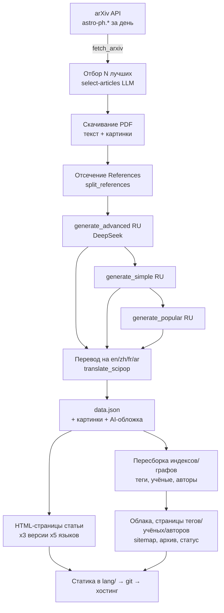
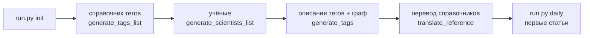

# bridge42worlds — Project Handoff

> Онбординг-документ для нового участника команды. Описывает цель, архитектуру,
> модель данных, порядок инициализации, команды и «фишки» проекта.
> Актуально на 2026-07-04.

---

## 1. Что это и зачем (миссия)

**bridge42worlds** — статический многоязычный научно-популярный сайт, который
**автоматически превращает свежие научные препринты с arXiv в понятные статьи**
на 5 языках, с тремя уровнями сложности изложения.

Идея названия — «мост между двумя мирами»: миром строгой науки (arXiv, формулы,
препринты) и миром обычного любопытного читателя.

**Ключевая ценность:** каждый день выходят сотни статей по астрофизике, которые
никто, кроме специалистов, не читает. Мы берём их полный текст, прогоняем через
LLM и выдаём:
- **три версии** одной статьи: `popular` (для всех) → `simple` → `advanced` (близко к оригиналу);
- **на 5 языках** (ru/en/zh/fr/ar, включая RTL-арабский);
- размеченные **тегами** (понятия физики), **учёными** и **авторами**;
- с извлечёнными из PDF картинками и подписями.

Вокруг статей выстроена **образовательная карта**: теги, учёные, авторы и их
взаимосвязи (графы), чтобы читатель мог гулять по знанию, а не только по ленте.

---

## 2. Функциональность (что уже есть)

**Контент**
- Пайплайн arXiv → LLM → статичный HTML (полностью автоматический).
- 3 уровня сложности (`popular`/`simple`/`advanced`), переключатель на статье и в ленте.
- 5 языков; русский — язык-источник, остальные — машинный перевод справочников и статей.
- Извлечение картинок из PDF + подписи (`figcaption`), мозаика-лента изображений.
- AI-обложки статей (FLUX через DeepInfra, опционально по ключу).
- Отсечение списка литературы (References) из текста перед LLM (экономия ~20% токенов).

**Навигация и открытие**
- Главная = бесконечная лента, сгруппированная по дням.
- **Календарь-фильтр** (год→месяц→день) на главной.
- **Фильтр по разделам arXiv** (Cosmology, Exoplanets…) чекбоксами.
- Полнотекстовый поиск + фильтры `#тег @автор !учёный`.
- Страницы тегов, учёных, авторов — каждая со списком релевантных статей.
- **Графы**: тег↔тег (образовательная карта понятий), учёный↔тег, соавторский граф автора.
- Облака тегов/учёных с переключателем «список ↔ граф».
- Архив (краулабельный для SEO) + sitemap на каждый язык.

**UX**
- Тёмная/светлая тема (localStorage).
- Полноценный RTL для арабского.
- Лайки (клиентские), кнопка «поделиться».
- «Я автор — подтвердить» (заготовка под верификацию авторов).
- Время чтения, JSON-LD (ScholarlyArticle), счётчик статей/авторов/учёных.

---

## 3. Архитектура

Сайт **полностью статический** — нет бэкенда в рантайме. Есть **генератор**
(Python), который раз в день собирает HTML, и **хостинг статики** (GitHub Pages,
домен `bridge42worlds.org`). Вся «динамика» на клиенте — JS читает готовые JSON-индексы.



**Слои:**
- `generate.py` — ядро (~2000 строк): fetch, LLM-вызовы, сборка HTML, индексы, графы.
- `run.py` — оркестратор-CLI (единая точка входа со всеми командами).
- `generate_tags*.py`, `generate_scientists_list.py`, `translate_reference.py`,
  `add_language.py` — отдельные шаги (справочники тегов/учёных, переводы, новый язык).
- `templates/*.html` — шаблоны страниц (`string.Template`, плейсхолдеры `$name`).
- `js/*.js`, `css/style.css` — клиентская часть (поиск, лента, графы, фильтры, тема).
- `data/prompts/*.txt` — промпты LLM.

---

## 4. Модель данных

**Источник правды — `data.json` в папке каждой статьи.** Всё остальное
(индексы, графы, облака, HTML) пересобирается из них.

```
lang/
  ru/                                  ← язык-источник (default_lang)
    archive/YYYY-MM-DD/<arxiv_id>/
      data.json          ← ПРАВДА: 3 версии × языки + мета
      original.pdf
      references.txt     ← отсечённый список литературы (на будущее)
      0.jpg … N.jpg      ← картинки из PDF
      ai.jpg             ← AI-обложка (если есть ключ)
      api/               ← сырые ответы LLM (advanced/simple/popular-ru.json, image-prompt.txt)
      index.html         ← popular-версия (дефолт)
      simple.html / advanced.html
    articles-index.json           ← popular-лента (для JS)
    articles-index-simple.json
    articles-index-advanced.json
    data/
      tags.json          ← справочник тегов (описания 3 уровней, формулы, учёные)
      tags-list.json     ← активные теги (для разметки статей)
      tags-list-educational.json
      scientists.json    ← справочник учёных (биография, related_tags)
    tags/  scientists/  authors/     ← сгенерированные страницы
  en/ zh/ fr/ ar/                      ← переводы справочников + свои индексы/страницы
data/
  tags-graph.json        ← граф тегов (связи, уровень, счётчики статей, educational-флаг)
  authors-graph.json     ← граф авторов (статьи, соавторы)
```

**`data.json` (одна статья):**
```json
{
  "id": "2606.02912v1",
  "original_title": "...",
  "authors": ["...", "..."],
  "date": "2026-06-01",
  "license": "...", "license_name": "CC BY 4.0",
  "tags": ["neutron_star", "..."], "main_tag": "neutron_star",
  "scientists": ["Werner Heisenberg", "..."],
  "categories": ["astro-ph.HE", "cs.LG"],   ← разделы arXiv (фильтр)
  "primary_category": "astro-ph.HE",
  "cited_arxiv": ["2601.01234", "..."],       ← id цитируемых работ (на будущее)
  "captions": ["Figure 1: ...", "..."],
  "popular":  { "ru": {…scipop…}, "en": {…}, "zh": {…}, "fr": {…}, "ar": {…} },
  "simple":   { … },
  "advanced": { … }
}
```
где `scipop` = `{title, oneliner, description, history, how_it_works, formulas,
main_tag, extra_tags, scientists, …}`.

**Ключевая связь для образовательной карты:**
`статья → теги → (учёные, формулы, связанные теги)`. Учёные и формулы привязаны к
тегам; статьи подтягивают релевантных учёных/формулы **через теги**, а не напрямую.

---

## 5. Порядок инициализации (с нуля)



1. **`run.py init`** — строит справочники: список тегов → учёные → описания тегов
   (3 уровня) + граф тегов → перевод справочников на все языки.
2. **`run.py daily`** (или `range --from --to`) — генерирует статьи за день/период.
   Статьи размечаются по **активным** тегам, поэтому теги должны быть готовы раньше.
3. **`run.py html`** — пересборка всего HTML из `data.json` без обращения к API
   (после правок шаблонов/CSS/JS).

⚠️ **Важные нюансы (документируем, чтобы не наступать):**
- `run.py html` **не** перегенерирует главную `index.html` — для неё нужен явный
  `generate.generate_index_page(lang)`.
- Ассеты подключаются с `?v=N` — при правке CSS/JS **поднимай версию** во всех
  шаблонах, иначе браузеры отдадут старое из кэша.
- Русский — источник; языковой **guard** (`_default_lang_ok`) не даёт LLM
  сгенерировать английский в русскую базу. Старые батчи, сделанные до guard, надо
  пересканировать и перегенерить.

---

## 6. Команды `run.py`

| Команда | Что делает |
|---|---|
| `init` | Первичная настройка справочников (теги, учёные, переводы). |
| `daily [--date D] [--force]` | Сгенерировать один день (по умолчанию — вчера). |
| `range --from D --to D` | Диапазон дней (наполнение историей). |
| `regen-day --date D` | Пересоздать все статьи дня. |
| `regen <arxiv_id>` | Пересоздать одну статью с нуля. |
| `delete <arxiv_id>` | Удалить статью (контент, картинки, индексы). |
| `html` | Пересобрать весь HTML из `data.json` (без API). |
| `reindex` | Пересобрать индексы и графы из `data.json`. |
| `tags [--educational-only]` | Пересобрать теги (список+описания+граф+облака). |
| `status` | Дашборд состояния → `status.html`. |
| `check [--fix]` | Проверка целостности; `--fix` чинит офлайн. |
| `images [--force]` | AI-обложки (нужен `DEEPINFRA_API_KEY`). |
| `add-lang <code>` | Добавить новый язык (backfill переводов). |
| `author`, `ids` | Утилиты по авторам/id. |

---

## 7. Модели и промпты (LLM)

- **DeepSeek** (`deepseek-v4-flash` через OpenAI-совместимый клиент,
  `api.deepseek.com`) — генерация статей, описаний тегов, учёных, переводы.
  Ключ: `DEEPSEEK_API_KEY` в `.env`.
- **FLUX-2-pro** (DeepInfra) — AI-обложки. Ключ: `DEEPINFRA_API_KEY` (опционально).
- Промпты — в `data/prompts/`:
  - `system.txt` — общий системный промпт;
  - `select-articles.txt` — отбор лучших статей дня;
  - `generate-article-advanced|simple|popular.txt` — три уровня;
  - `translate-article.txt` — перевод статьи;
  - `generate-tags.txt` — описания тегов (3 уровня за раз);
  - `generate-ai-image.txt` — промпт для обложки.
- Генерация идёт **каскадом**: advanced (из полного текста) → simple (из advanced)
  → popular (из simple) → переводы каждой версии на 4 языка.

---

## 8. Конфигурация (`config.json`)

Все количества и параллелизм — из одного файла:
```json
{
  "languages": ["ru","en","zh","fr","ar"], "default_lang": "ru",
  "max_articles": 10, "selection_percent": 20, "article_workers": 3,
  "tags":       { "active_count": 120, "educational_count": 50, "workers": 5 },
  "scientists": { "total": 100, "per_request": 5, "workers": 4 }
}
```
- `active_count` тегов — идут в промпт разметки статей (не раздуваем).
- `educational_count` — «справочные» теги (физика/математика) только для
  облака/графа (образовательная карта), в разметке не участвуют.

---

## 9. Фишки и договорённости

- **Двухъярусные теги**: активные (разметка) + образовательные (карта знаний).
- **Языковой guard**: детектор кириллицы отбраковывает случайный английский в
  русской базе с автоповтором запроса.
- **References-стриппинг**: список литературы вырезается из текста для LLM
  (экономия ~20% токенов), сохраняется в `references.txt`, а цитируемые arXiv-id —
  в `cited_arxiv` (задел под «релевантные работы»).
- **Кэш-инвалидация** через `?v=N` на всех ассетах.
- **SEO**: лента человеку (JS), а поисковику — sitemap + краулабельный архив с
  реальными `<a>`-ссылками.
- **Устойчивость**: `run.py check` ловит висячие ссылки; генерация статьи
  переживает частичные сбои (сохраняет распарсенный результат вместо потери статьи).

---

## 10. Что в планах (roadmap)

- **Слой «Законы»** (закон/принцип/теорема/эффект) — ✅ Фаза 1 построена. Закон =
  текст (name + type + описание ×3 + история открытия), формула — его отображение
  (KaTeX) в карточке. «Законы для тегов = теги для статей». `run.py laws`,
  `data/laws-graph.json`, `lang/{lang}/data/laws.json`, страница `/laws/` (облако+граф),
  секция «Законы» на тегах. **Фаза 2 (в планах):** учёных генерить ИЗ законов
  (по истории открытия); в статьях показывать релевантные формулы через теги.
- **Релевантные работы** через `cited_arxiv` (связь статей по цитированию).
- **Масштаб** (горизонт 2–3 года ежедневных статей): шардирование индексов по
  месяцам, Pagefind для поиска, пагинация тегов, delta-upload.
- **Верификация авторов** через веб (GitHub Actions `workflow_dispatch`).
- Консолидация всех строк локализации в один `languages.json`.

---

*Технический контакт: см. git-историю и `MEMORY.md` (рабочий журнал решений).*
